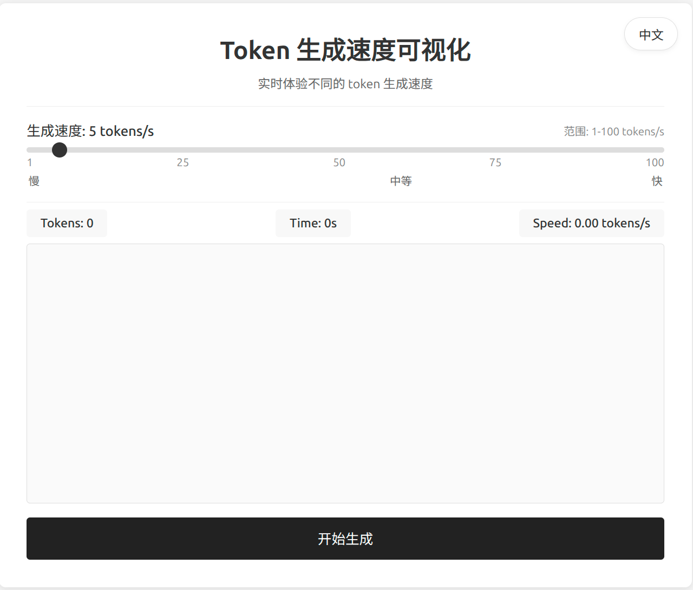

# Token 生成速度可视化工具 (Flask 版本)

<div align="center">
  
</div>

## 📝 项目简介

这是一个使用 Flask 和 JavaScript 实现的交互式 Web 应用，用于直观展示不同 token 生成速度的效果。在大语言模型（LLM）生成文本时，token 生成速度是一个重要的体验指标。本工具允许用户通过滑块实时调整生成速度（1-100 tokens/s），帮助开发者和用户理解不同生成速度对用户体验的影响。

## ✨ 功能特点

- 🎚️ **可调节速度**：通过滑块精确控制生成速度（1-100 tokens/s）
- 📊 **实时统计**：显示已生成的 tokens 数量、耗时和实际生成速度
- 📝 **文本可视化**：实时展示文本生成过程，模拟大语言模型的输出效果
- 🌐 **多语言支持**：提供中文和英文界面，通过下拉框轻松切换
- 📱 **响应式设计**：适应不同屏幕尺寸，提供良好的移动端体验
- ⚡ **高精度速度控制**：实际生成速度与设定速度高度一致，提供真实的体验
- 🔄 **智能预加载**：预加载文本内容，减少网络延迟影响

## 🔍 技术实现

### 🛠️ 核心技术栈

- **Flask** - Python Web 框架，提供后端 API 和页面渲染
- **JavaScript** - 实现前端交互逻辑和动画效果
- **HTML/CSS** - 创建美观、响应式的用户界面

### 📋 实现原理详解

#### 1. 文本生成模拟

- 前端通过 API 请求批量预加载文本，减少网络延迟影响
- 使用文本缓冲区和动态速度调整机制，确保生成速度与设定值一致
- 结合 `setTimeout` 和 `requestAnimationFrame` 实现精确的时间控制
- 通过理论生成速度计算和实际生成速度比较，动态调整渲染间隔

#### 2. 前后端分离架构

- Flask 提供 API 端点，支持单字符获取和批量文本获取
- 前端 JavaScript 处理 UI 更新、文本缓存和速度控制
- 使用 Fetch API 进行异步通信，实现高效的数据交换

#### 3. 国际化实现

- 后端存储不同语言的文本资源
- 前端通过 API 获取当前语言的翻译
- 支持中文和英文两种语言，可轻松扩展更多语言

## 🚀 构建与运行

### ⚙️ 环境要求

- **Python**
- **Flask**

### 📦 安装与构建

1. **克隆仓库**

   ```bash
   git clone https://github.com/boomytc/BoomTools.git
   cd token-speed-visualizer-flask
   ```

2. **创建虚拟环境**

   ```bash
   # 使用 venv (Python 标准库)
   python -m venv BoomTools_venv
   source BoomTools_venv/bin/activate  # Linux/Mac
   BoomTools_venv\Scripts\activate     # Windows

   # 或使用 conda
   conda create -n BoomTools python=3.12 -y
   conda activate BoomTools
   ```

3. **安装依赖**

   ```bash
   pip install -r requirements.txt
   ```

4. **运行应用**

   ```bash
   python app.py
   ```

   然后在浏览器中访问 http://127.0.0.1:5000

### 🌐 部署

可以使用多种方式部署 Flask 应用：

- **Gunicorn + Nginx**：适用于生产环境
- **PythonAnywhere**：简单的 PaaS 部署
- **Heroku**：支持自动部署
- **Docker**：容器化部署

## 📁 项目结构

```
token-speed-visualizer-flask/
├── app.py                 # Flask 应用主文件
├── requirements.txt       # 项目依赖
├── static/                # 静态资源
│   ├── css/               # CSS 样式
│   │   └── style.css      # 主样式文件
│   └── js/                # JavaScript 文件
│       └── script.js      # 主脚本文件
└── templates/             # HTML 模板
    └── index.html         # 主页模板
```

## 🔧 自定义与扩展

### 修改生成文本

如果你想修改生成的文本，可以编辑 `app.py` 文件中的 `FULL_TEXT` 变量。

### 扩展功能

以下是一些可能的扩展方向：

- 添加更多语言支持
- 实现不同的文本生成动画效果
- 添加暂停/继续功能
- 支持用户输入自定义文本
- 添加更多统计指标（如每分钟字数等）
- 实现更多生成模式（如突发模式、变速模式等）
- 添加网络延迟模拟，更真实地模拟实际环境
- 支持导出生成数据，用于性能分析
