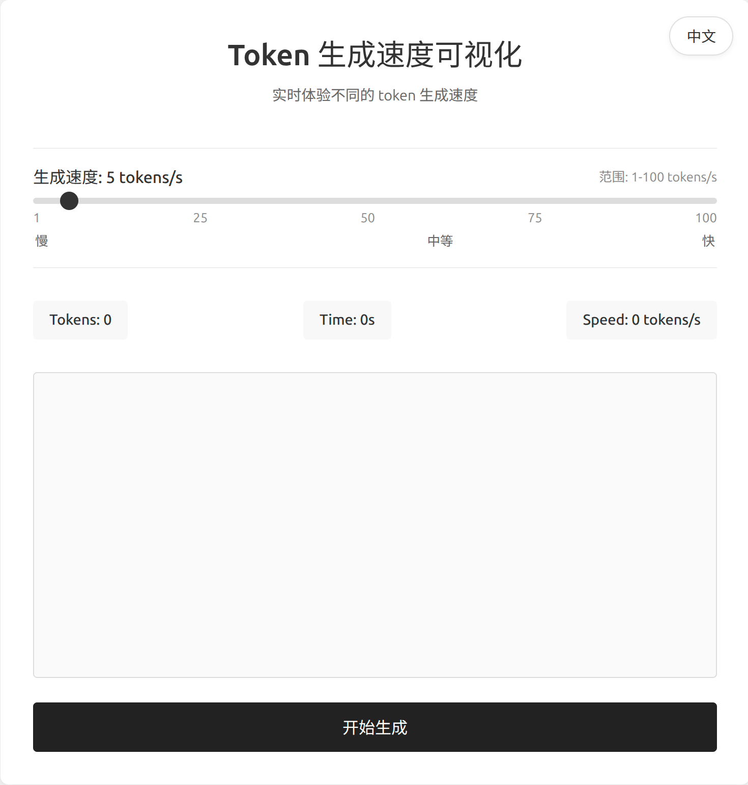

# Token 生成速度可视化工具 (Token Generation Speed Visualizer)

<div align="center">
  
</div>

## 📝 项目简介

这是一个交互式 Web 应用，用于直观展示不同 token 生成速度的效果。在大语言模型（LLM）生成文本时，token 生成速度是一个重要的体验指标。本工具允许用户通过滑块实时调整生成速度（1-100 tokens/s），帮助开发者和用户理解不同生成速度对用户体验的影响。

## ✨ 功能特点

- 🎚️ **可调节速度**：通过滑块精确控制生成速度（1-100 tokens/s）
- 📊 **实时统计**：显示已生成的 tokens 数量、耗时和实际生成速度
- 📝 **文本可视化**：实时展示文本生成过程，模拟大语言模型的输出效果
- 🌐 **多语言支持**：提供中文和英文界面，通过下拉框轻松切换
- 📱 **响应式设计**：适应不同屏幕尺寸，提供良好的移动端体验

## 🔍 技术实现

### 🛠️ 核心技术栈

- **React** - 用于构建高效、响应式的用户界面
- **Vite** - 现代化的前端构建工具，提供极速的开发体验
- **JavaScript (ES6+)** - 实现丰富的交互逻辑和动画效果
- **CSS3** - 创建美观、响应式的用户界面

### 📋 实现原理详解

#### 1. 文本生成模拟

- 使用 `setTimeout` 函数按照指定的时间间隔逐字生成文本
- 时间间隔通过 `1000 / speed` 计算（毫秒），实现精确的速度控制
- 递归调用实现连续生成效果，模拟大语言模型的输出过程

#### 2. React Hooks 状态管理

- **useState** - 管理应用核心状态（生成速度、已生成文本、tokens计数、界面语言等）
- **useRef** - 存储不触发重渲染的值（文本区域DOM引用、动画定时器引用、开始时间戳等）
- **useEffect** - 处理副作用和生命周期事件（清理定时器、滚动文本区域等）

#### 3. 国际化实现

- 使用对象字面量存储不同语言的文本资源
- 通过下拉框实现无刷新的语言切换
- 支持中文和英文两种语言，可轻松扩展更多语言

## 🚀 构建与运行

### ⚙️ 环境要求

- **Node.js** (v14.0.0 或更高版本)
- **npm** (v6.0.0 或更高版本)

### 📦 安装与构建

1. **克隆仓库**

   ```bash
   git clone https://github.com/yourusername/token-speed-visualizer.git
   cd token-speed-visualizer
   ```

2. **安装依赖**

   ```bash
   npm install
   ```

3. **开发模式**

   启动开发服务器，支持热模块替换（HMR）：

   ```bash
   npm run dev
   ```

   然后在浏览器中访问 http://localhost:5173

4. **构建生产版本**

   ```bash
   npm run build
   ```

   构建完成后，生成的文件将位于 `dist` 目录中。

### 🌐 部署

构建项目后，可以使用任何静态文件服务器托管 `dist` 目录：

```bash
# 使用 serve 包（需要先安装：npm install -g serve）
serve -s dist
```

也可以部署到 GitHub Pages、Netlify、Vercel 等静态网站托管服务。

## 📁 项目结构

```
token-speed-visualizer/
├── public/              # 静态资源
├── src/                 # 源代码
│   ├── App.jsx          # 主应用组件（核心逻辑）
│   ├── App.css          # 应用样式
│   ├── main.jsx         # 应用入口
│   └── index.css        # 全局样式
├── index.html           # HTML 模板
├── package.json         # 项目配置
└── vite.config.js       # Vite 配置
```

## 🔧 自定义与扩展

### 修改生成文本

如果你想修改生成的文本，可以编辑 `App.jsx` 文件中的 `fullText` 变量：

```jsx
// 在 App.jsx 中找到并修改这个变量
const fullText = `你想要显示的文本...`;
```

### 扩展功能

以下是一些可能的扩展方向：

- 添加更多语言支持
- 实现不同的文本生成动画效果
- 添加暂停/继续功能
- 支持用户输入自定义文本
- 添加更多统计指标（如每分钟字数等）